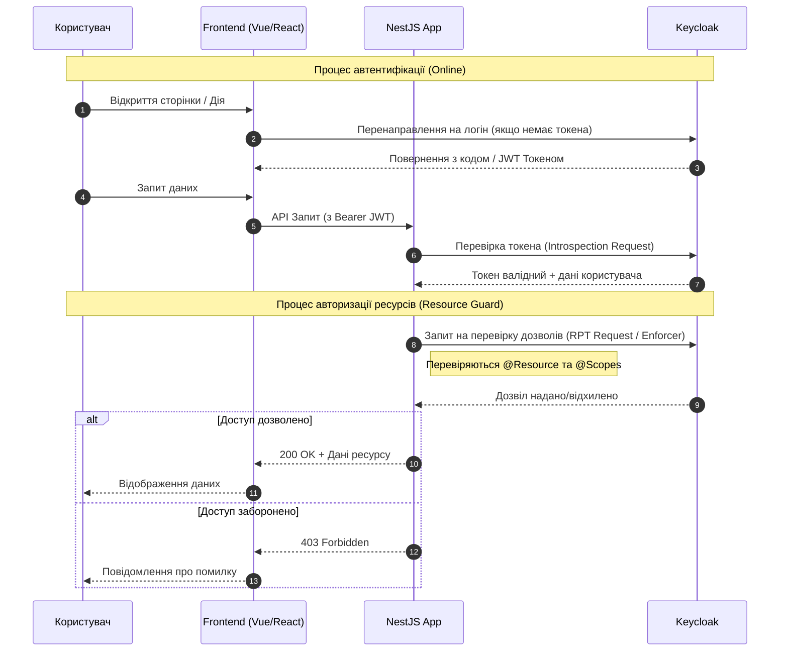
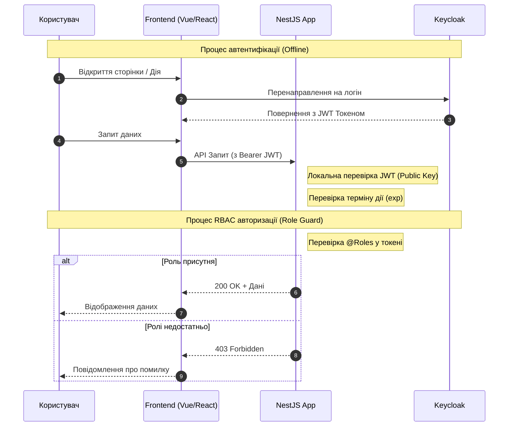
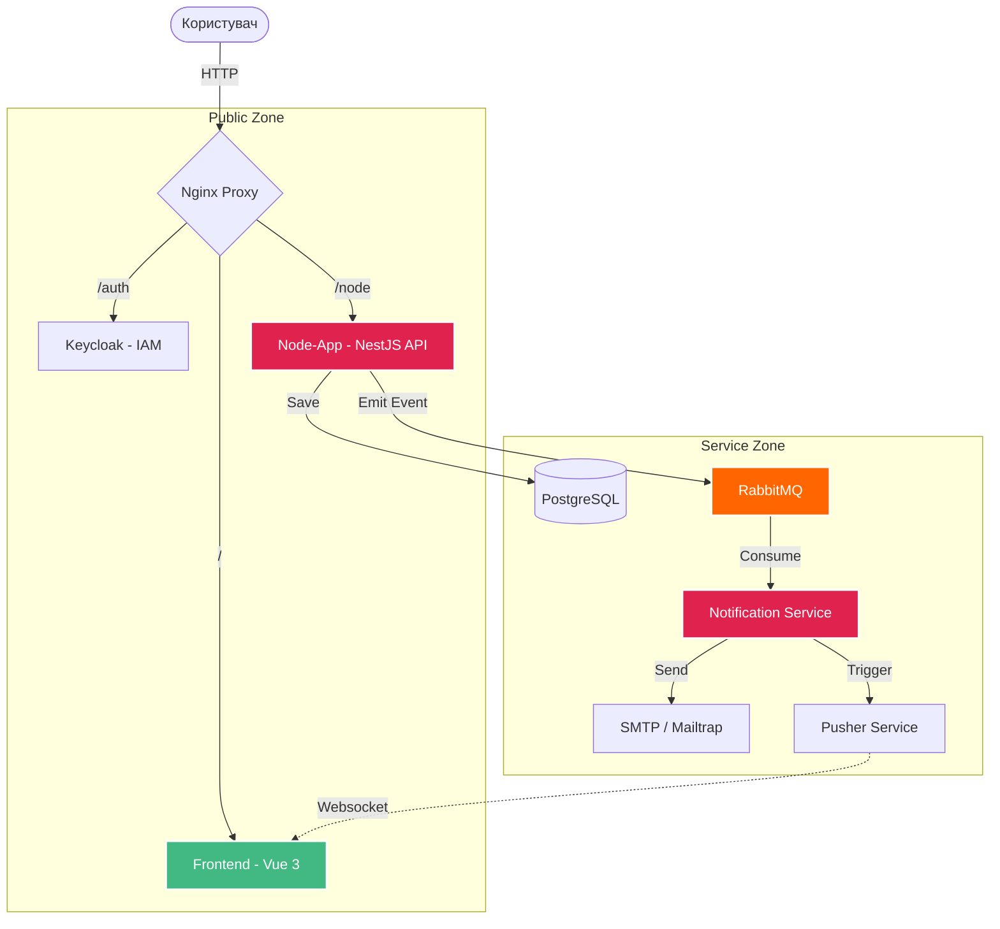

# Менеджери черг: Як надати архітектурі гнучкості та витривалості

## 1. Проблема «крихкої» взаємодії
Уявіть класичну ситуацію: ви будуєте інтернет-магазин. Коли користувач натискає кнопку «Замовити», ваш **Order Service** має одночасно:
1. Списати гроші.
2. Оновити складські залишки.
3. Надіслати лист-підтвердження.

Якщо в цей момент сервіс розсилки листів «впав», весь ланцюжок запитів розривається. Користувач бачить помилку 500, хоча гроші списалися. Це і є проблема **жорсткого зв'язку (tight coupling)** та синхронної взаємодії.

## 2. Що таке Message Broker?
Щоб вирішити це, ми вводимо посередника — **менеджера черг** (або брокера повідомлень).

Це можна порівняти з поштовим відділенням. Ви (як **Producer**) не чекаєте адресата під дверима, поки він звільниться. Ви просто кладете конверт у скриньку. Брокер бере на себе відповідальність за те, щоб цей конверт дочекався свого отримувача (**Consumer**).

### Основні ролі в системі:
* **Producer (Виробник):** Відправляє дані (наприклад, «Замовлення №123 створено»).
* **Exchange (Обмінник):** Сортувальний центр, який вирішує, у яку чергу відправити повідомлення.
* **Queue (Черга):** Тимчасове сховище повідомлень.
* **Consumer (Споживач):** Забирає повідомлення та виконує роботу (наприклад, відправляє Email).

---

## 3. Чому це архітектурна перемога?

### Асинхронність та чуйність
Ваш основний сервіс не чекає, поки обробляться важкі завдання (генерація PDF, ресайз фото, відправка пошти). Він просто «кидає» задачу в чергу і миттєво відповідає користувачу: *"Прийнято, скоро все буде готово"*.

### Вирівнювання навантаження (Load Leveling)
Під час розпродажів на систему може прилетіти 10,000 запитів на секунду. Якщо ваша база даних витримує лише 1,000, без черги вона просто «помре». З чергою повідомлення накопичаться в буфері, а сервіси оброблять їх поступово, у своєму нормальному темпі.

### Відмовостійкість
Якщо сервіс-споживач вимкнувся на 10 хвилин — нічого страшного. Повідомлення нікуди не зникнуть. Щойно сервіс знову з'явиться в мережі, він продовжить обробку з того місця, де зупинився.

---

## 4. Який інструмент обрати?

У світі Enterprise-розробки ви найчастіше зустрінете цю трійцю:

| Інструмент | Головна фішка | Коли використовувати? |
| :--- | :--- | :--- |
| **RabbitMQ** | Розумна маршрутизація | Складні бізнес-процеси, де важлива гнучка логіка доставки. |
| **Apache Kafka** | Гігантська пропускна здатність | Аналітика в реальному часі, робота з великими даними (Big Data). |
| **Redis** | Надзвичайна швидкість | Прості, легкі черги, де швидкість важливіша за 100% надійність. |

---

## 5. Підводні камені (Про що варто пам'ятати)
Черги — це не срібна куля. Вони додають **складності**:
* **Eventually Consistency:** Дані в системі оновлюються не миттєво. Наприклад, статус замовлення може змінитися через секунду після його створення.
* **Повторна обробка:** Ви повинні бути впевнені, що якщо повідомлення прийде двічі (наприклад, через збій мережі), ваш сервіс не спише гроші з клієнта два рази (**Idempotency**).
* **Моніторинг:** Якщо черга починає безконтрольно рости — це сигнал, що ваша система не справляється і скоро почнуться проблеми.

---

> **Порада для студентів:** Розуміння черг — це перехід від написання простих скриптів до проектування стійких систем, що витримують мільйони користувачів. Почніть з RabbitMQ, щоб зрозуміти базу, а потім дивіться в бік Kafka для складніших задач.

Приклад реалі**зації системи сповіщень з використанням NestJS, Keycloak та кількох баз даних.**

## Запуск проекту

Для запуску проекту необхідно мати встановлений Docker та Docker Compose.

1. Перейдіть до директорії проекту:
   ```bash
   cd 08-notification
   ```

2. Запустіть контейнери:
   ```bash
   docker-compose up -d
   ```

3. **Налаштування локального домену (hosts)**:
   Оскільки проект використовує домен `demo-app.local`, вам необхідно додати його до вашого файлу `hosts`:
   - **Windows**: Запустіть Блокнот від імені адміністратора та відкрийте файл `C:\Windows\System32\drivers\etc\hosts`. Додайте рядок:
     ```text
     127.0.0.1 demo-app.local
     ```
   - **Linux / macOS**: Виконайте команду в терміналі:
     ```bash
     sudo sh -c 'echo "127.0.0.1 demo-app.local" >> /etc/hosts'
     ```

4. Після запуску сервіси будуть доступні за наступними адресами:
   - **Frontend (Nginx)**: [http://demo-app.local](http://demo-app.local)
   - **Keycloak**: [http://demo-app.local/auth](http://demo-app.local/auth) (логін/пароль: `admin`/`admin`)
   - **Node.js API (NestJS)**: [http://demo-app.local/node](http://demo-app.local/node)
   - **Frontend (Dev Server)**: [http://localhost:5173](http://localhost:5173) (якщо запущено локально)
   - **Swagger UI**: [http://demo-app.local/node/api-docs](http://demo-app.local/node/api-docs)
   - **PHP (Laravel)**: [http://demo-app.local/php](http://demo-app.local/php)
   - **Adminer**: [http://localhost:8001](http://localhost:8001) (або [http://demo-app.local:8001](http://demo-app.local:8001))

## Конфігурація (.env)

Проект використовує змінні середовища для налаштування підключень та безпеки.

1. **Головний .env** (`08-notification/.env`): Містить спільні змінні для Docker Compose (паролі БД, налаштування Keycloak для контейнерів).
2. **Node.js .env** (`08-notification/node-app/.env`): Містить налаштування специфічні для NestJS додатку.

У файлах з'явилася нова змінна `APP_DOMAIN` (за замовчуванням `demo-app.local`), яка використовується для формування посилань у Swagger та налаштування мережі.

Перед запуском ви можете змінити паролі та хости у цих файлах.

## Бази даних

У проекті використовуються дві системи керування базами даних (СКБД). Усі необхідні бази даних створюються автоматично при першому запуску.

### PostgreSQL
- **Хост**: `pg` (всередині мережі Docker) або `localhost:5432`
- **Користувач**: `${POSTGRES_USER}`
- **Пароль**: `${POSTGRES_PASSWORD}`
- **Бази даних, що створюються**:
  - `keycloak`: використовується для зберігання даних Keycloak.
  - `nestjs`: використовується основним додатком Node.js.

### MySQL
- **Хост**: `mysql` (всередині мережі Docker) або `localhost:3309`
- **Користувач**: `${MYSQL_USER}`
- **Пароль**: `${MYSQL_PASSWORD}`
- **Бази даних, що створюються**:
  - `laravel`: використовується PHP додатком.

## Схема онлайн автентифікації та авторизації ресурсів

У даному проекті використовується онлайн-валідація токенів (`TokenValidation.ONLINE`). Це означає, що при кожному запиті додаток звертається до Keycloak для перевірки валідності токена та прав доступу до ресурсів.



### Пояснення до схеми:
1. **Автентифікація**: Додаток отримує JWT токен від користувача та надсилає його в Keycloak на ендпоінт інтроспекції для підтвердження того, що токен не відкликаний і є актуальним.
2. **Авторизація ресурсів**: `ResourceGuard` у NestJS використовує декоратори `@Resource` та `@Scopes` для формування запиту до Keycloak Policy Enforcer. Keycloak перевіряє, чи має даний користувач права на виконання вказаної дії з ресурсом.

## Схема офлайн автентифікації та RBAC авторизації

При використанні офлайн-валідації (`TokenValidation.OFFLINE`), додаток перевіряє підпис JWT токена локально за допомогою публічного ключа Keycloak. Для авторизації за ролями (RBAC) використовується `RoleGuard`.



### Пояснення до схеми:
1. **Автентифікація (Офлайн)**: Додаток не звертається до Keycloak при кожному запиті. Він використовує заздалегідь отриманий публічний ключ (`realmPublicKey`) для перевірки підпису токена та перевіряє стандартні поля (issuer, expiration тощо).
2. **RBAC авторизація**: `RoleGuard` перевіряє наявність необхідних ролей (наприклад, `admin`, `user`) безпосередньо у розкодованому JWT токені (секція `realm_access.roles` або `resource_access`). Це значно швидше, оскільки не потребує мережевих запитів.

## Архітектура системи

Проект побудований на мікросервісній архітектурі з використанням подій (Event-Driven Architecture).

### Компоненти системи:

- **Frontend (Vue 3)**: Клієнтський додаток, що використовує Vite для збірки, Pinia для керування станом та Keycloak для автентифікації. Підключений до Pusher для отримання миттєвих сповіщень.
- **Node-App (NestJS)**: Основний бекенд-сервіс (API). Працює з базою даних PostgreSQL. При створенні нових ресурсів (наприклад, категорій) він не відправляє сповіщення самостійно, а публікує подію в RabbitMQ.
- **Notification Service (NestJS)**: Спеціалізований мікросервіс для обробки сповіщень. Він слухає чергу в RabbitMQ і виконує дві дії:
  - Відправляє Email через SMTP (Mailtrap у режимі розробки).
  - Надсилає подію в Pusher для миттєвого відображення на фронтенді.
- **RabbitMQ**: Брокер повідомлень, що забезпечує асинхронний зв'язок між сервісами. Це дозволяє основному API працювати швидше, не чекаючи завершення відправки пошти.
- **Nginx**: Виступає в ролі Reverse Proxy, забезпечуючи єдину точку входу для всіх сервісів через домен `demo-app.local`.

### Схема взаємодії компонентів:



### Процес створення категорії:
1. Користувач створює категорію у **Frontend**.
2. **Node-App** перевіряє права через **Keycloak**, зберігає дані в **PostgreSQL**.
3. **Node-App** надсилає повідомлення `category_created` у **RabbitMQ**.
4. **Notification Service** отримує повідомлення з черги.
5. **Notification Service** одночасно відправляє лист адміністратору та сигнал у **Pusher**.
6. **Frontend**, що підписаний на канал Pusher, отримує сигнал і показує спливаюче повідомлення (Toast) користувачу.
